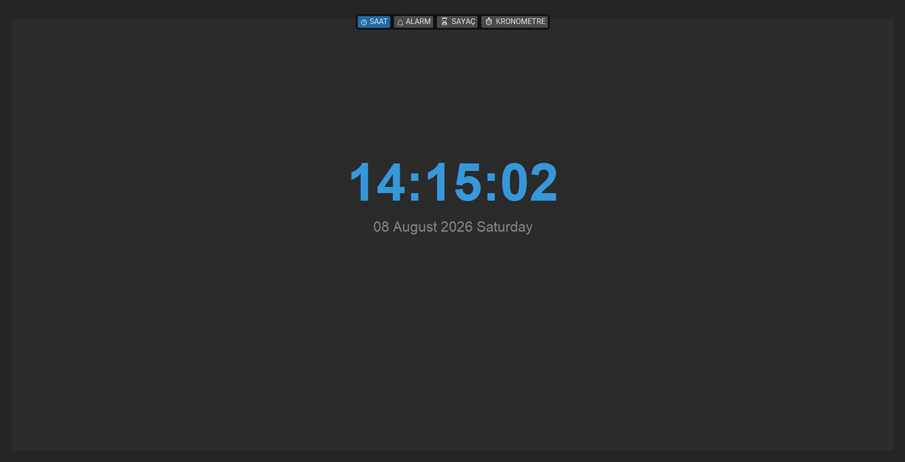
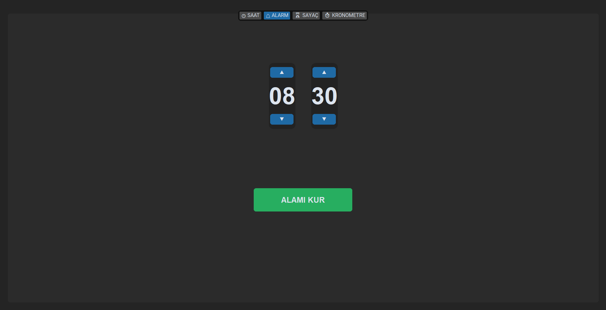
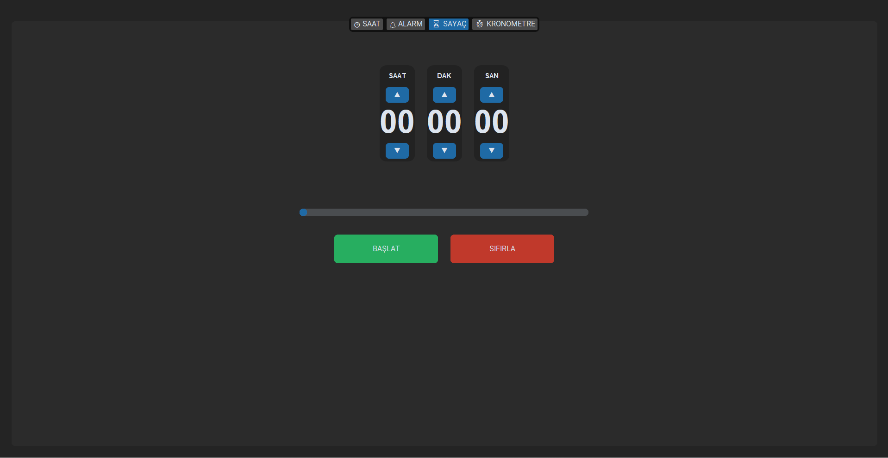
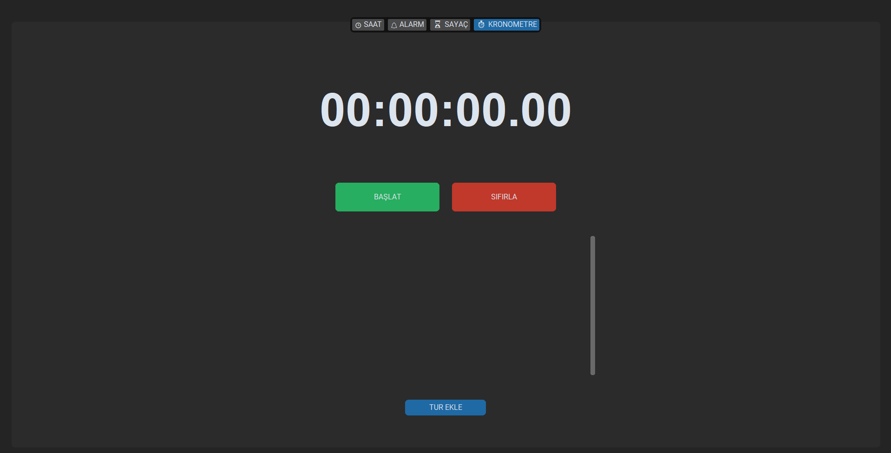

# Ultra Clock

A multifunctional desktop time management application built with Python and CustomTkinter.

## Features

- Real-time clock and date display
- Alarm system
- Countdown timer
- Stopwatch
- Stopwatch lap functionality
- Interactive graphical user interface
- User notifications

## Technologies

- Python
- CustomTkinter
- Tkinter
- datetime
- messagebox

## Screenshots

### Clock

### Alarm

### Timer

### Stopwatch

## About

Ultra Clock is a desktop application designed to combine several time-related tools into a single user-friendly interface.

The project was developed as a personal Python project to improve programming, GUI development, and problem-solving skills.

## Application

The application is packaged as a standalone `.exe` file so it can run without requiring a Python installation.
